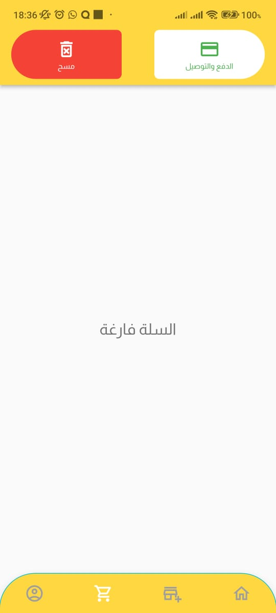
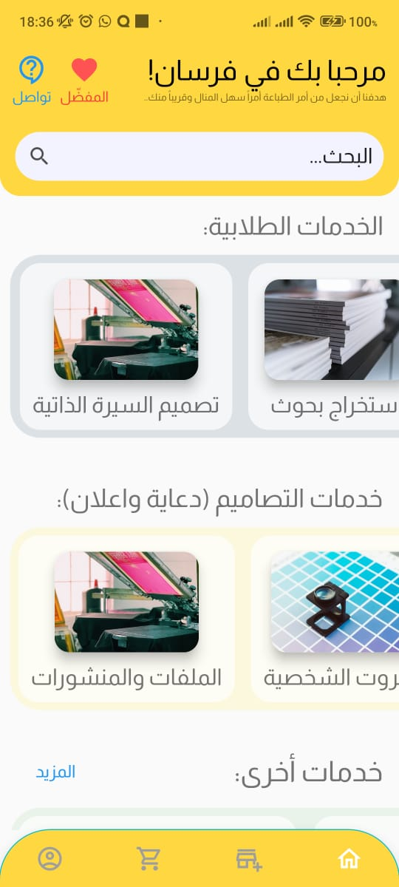
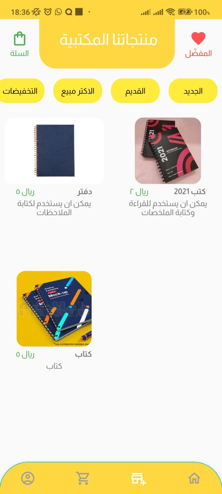

# Printing and Library Services App

## Overview

Welcome to our Printing and Library Services App! This Flutter-based application is designed to streamline the process of managing products, printing services, points, and orders. Whether you're a library enthusiast or looking for efficient printing solutions, this app has got you covered.

## Features

### 1. Product Management

- **Browse Products:** Explore a wide range of products available in our library or printing services.
- **Detailed Product Information:** Get comprehensive details about each product, including pricing, availability, and more.

### 2. Printing Services

- **Upload and Print:** Easily upload documents or designs and place printing orders.
- **Print Status Tracking:** Keep track of the status of your printing orders in real-time.
- **Print History:** Access your printing history for reference and reordering.

### 3. Points and Rewards

- **Earn Points:** Accumulate points with each purchase or printing order.
- **Redeem Rewards:** Enjoy exclusive discounts or benefits by redeeming your accumulated points.
- **Points History:** View a history of your points and reward redemptions.

### 4. Orders Management

- **Order Tracking:** Monitor the progress of your product purchases and printing orders.
- **Order History:** Access a detailed history of all your past orders for reference.

### 5. User Account

- **Profile Management:** Update your personal information, including profile picture and contact details.
- **Security:** Ensure the safety of your data with secure login and authentication measures.

## Getting Started

To run the app locally, follow these steps:

1. **Clone the Repository:**
   ```
   git clone https://github.com/Syf-almjd/forsan.git
   ```

2. **Navigate to the Project Directory:**
   ```
   cd forsan
   ```

3. **Install Dependencies:**
   ```
   flutter pub get
   ```

4. **Run the App:**
   ```
   flutter run
   ```

### Screenshots

| Screenshot 1                                    | Screenshot 2                                    |
|-------------------------------------------------|-------------------------------------------------|
|  |  |

| Screenshot 4                                    | Screenshot 5                                    |
|-------------------------------------------------|-------------------------------------------------|
|  |  |


## Requirements

- Flutter 2.0.0 or later
- Dart 2.12.0 or later
- Internet connection for some features

## Contributing

We welcome contributions! If you find any issues or have suggestions for improvement, please feel free to open an issue or submit a pull request.

## License

This project is licensed under the [MIT License](https://opensource.org/license/mit/).

## Contact

For any inquiries or support, please contact our team at support@example.com.

Thank you for using our Printing and Library Services App! We hope it enhances your printing and library experience.


# More About Forsan Service!

Forsan offers high-quality online printing services for your documents and files at competitive prices, with delivery available across the Kingdom.

## Table of Contents
- [Order Processing and Delivery Policies](#order-processing-and-delivery-policies)
   - [Branch Pickup](#branch-pickup)
   - [Delivery Within Jeddah](#delivery-within-jeddah)
   - [Delivery Outside Jeddah](#delivery-outside-jeddah)
- [Contact Us](#contact-us)

## Order Processing and Delivery Policies

📦 **Branch Pickup**

For orders paid via "Mada," processing will take place within 24 working hours, except for Fridays, which are not considered working days. Orders with payment upon pickup will be printed upon your branch visit and payment.

🚚 **Delivery Within Jeddah**

If you place an order on the website, it will be printed and delivered within 24 to 48 working hours, excluding Fridays.

If you order via WhatsApp, we will acknowledge your request within 24 hours, provide you with an order number, and then print and deliver your order within 24 to 48 working hours, excluding Fridays.

🚚 **Delivery Outside Jeddah**

If you order on the website, your order will be printed within 24-48 hours and shipped via Aramex. Delivery times will adhere to Aramex's policies. Fridays are not considered working days, and cash on delivery is not available.

If you order via WhatsApp, we will acknowledge your request within 24 hours, provide you with an order number, and then print and ship your order via Aramex within 24-48 hours, adhering to Aramex's delivery policies. Fridays are not considered working days, and advance payment is required.

## Contact Us

For technical support or complaints, please contact us at:

📧 Email: [forsan.print@gmail.com](mailto:forsan.print@gmail.com)

📞 Phone: [051236432](tel:+96651236432)

---


فرسان تقدم خدمات طباعة عالية الجودة لأوراقك وملفاتك عبر الإنترنت بأسعار تنافسية، مع خدمة التوصيل المتاحة في جميع مناطق المملكة.

## جدول المحتويات
- [سياسة معالجة الطلبات والتوصيل](#سياسة-معالجة-الطلبات-والتوصيل)
   - [استلام من الفرع](#استلام-من-الفرع)
   - [التوصيل داخل جدة](#التوصيل-داخل-جدة)
   - [التوصيل خارج جدة](#التوصيل-خارج-جدة)
- [تواصل معنا](#تواصل-معنا)

## سياسة معالجة الطلبات والتوصيل

📦 **استلام من الفرع**

سيتم معالجة الطلبات المدفوعة عبر "مدى" خلال 24 ساعة عمل، مع ملاحظة أن يوم الجمعة لا يعتبر يوم عمل. الطلبات التي تتطلب الدفع عند الاستلام سيتم طباعتها عند وصولك إلى الفرع والدفع.

🚚 **التوصيل داخل جدة**

إذا قمت بطلب عبر الموقع، سيتم طباعة الطلب وتوصيله خلال 24 إلى 48 ساعة عمل، باستثناء أيام الجمعة.

إذا قمت بالطلب عبر واتساب، سنقوم بتأكيد طلبك خلال 24 ساعة وتزويدك برقم الطلب، ثم سيتم طباعة طلبك وتوصيله خلال 24 إلى 48 ساعة عمل، باستثناء أيام الجمعة.

🚚 **التوصيل خارج جدة**

إذا قمت بالطلب عبر الموقع، سيتم طباعة الطلب خلال 24-48 ساعة ثم شحنه عبر شركة الشحن أرامكس. ستتم مدة التوصيل وفقًا لسياسة شركة الشحن. يوم الجمعة لا يعتبر يوم عمل، ولا يتوفر دفع عند الاستلام.

إذا قمت بالطلب عبر واتساب، سنقوم بتأكيد طلبك خلال 24 ساعة وتزويدك برقم الطلب، ثم سيتم طباعة الطلب خلال 24-48 ساعة ثم شحنه عبر شركة الشحن أرامكس. ستتم مدة التوصيل وفقًا لسياسة شركة الشحن. يوم الجمعة لا يعتبر يوم عمل، ويتطلب دفع المبلغ مسبقًا.

## تواصل معنا

للدعم الفني أو الشكاوى، يمكنك التواصل معنا عبر:

📧 البريد الإلكتروني: [forsan.print@gmail.com](mailto:forsan.print@gmail.com)

📞 الهاتف: [051236432](tel:+96651236432)


